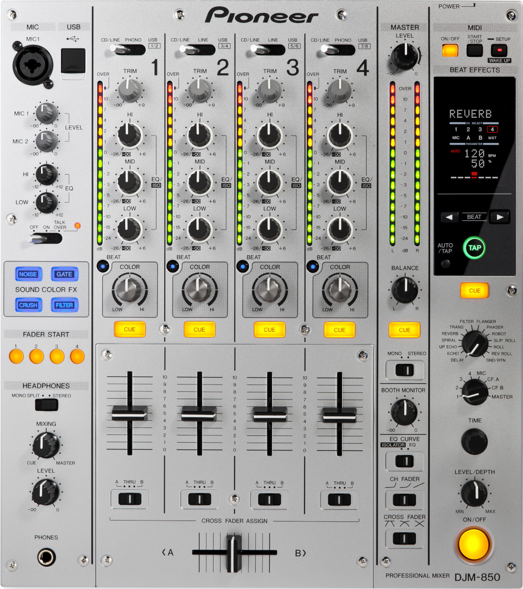

# Pioneer DJM-850 driver reverse engineering

This repository contains the study of the [Pioneer DJM-850](https://www.pioneerdj.com/en-us/product/mixer/archive/djm-850/silver/overview/)
Windows driver and setting utility. The aim of this study is to understand how
the computer and the device are communicating hover USB, in order to be able
to write a driver and a clone of the Windows setting utility for a GNU/Linux
system, as Pioneer
[do not plan to write anything for this platform](https://forums.pioneerdj.com/hc/en/community/posts/203039979--SOLVED-DJM850-900-Linux-progress-).

This repository contains the reverse engineering results, also explains the RE
process and can be used as a reference for the driver and setting utility
implementations.

*Table of contents :*

- [Workstation setup](doc/workstation-setup.md)
- [USB device specifications](doc/usb-device-specifications.md)
- [Windows DJM-850 Setting Utility](doc/windows-djm-850-setting-utility/README.md)
- [Plugged in idle behavior](doc/plugged-in-idle-behavior/README.md)
- [DVS (Digital Vinyl System) usage on Windows](doc/windows-dvs/README.md)
- [Roadmap](#roadmap)
- [Firmware and driver versions](#firmware-and-driver-versions)
- [Legal notices](#legal-notices)

## Roadmap

- [Windows DJM-850 Setting Utility](doc/windows-djm-850-setting-utility/README.md) :
    - [x] Study the discussion when plugging in the device to the computer.
    - [x] Study the discussion when plugging out the device from the computer.
    - [x] Study the `Mixer input` tab and determine the communication for the
available options.
    - [x] Study the `Mixer output` tab and determine the communication for the
available options.
    - [x] Study the `ASIO` tab and determine the communication for the
available options.
    - [x] Explain the autolaunch behavior of the Setting Utility.
- [Plugged in idle behavior](doc/plugged-in-idle-behavior/README.md)
    - [x] Study the transmitted messages when the mixer is plugged into the
computer without being used (neither by user nor opened GUI software).
- [DVS (Digital Vinyl System) usage on Windows](doc/windows-dvs/README.md) :
    - [x] Determine how the timecode signal is sent to the computer, and how
the computer sends music signal to the mixer.
    - [x] Determine how the left and right audio channels are modelized in
the digital audio signal.
    - [x] Determine how the USB `1/2`, `3/4`, `5/6` and `7/8` signal routing
is modelized.
    - [x] Determine how the framerate is modelized and used.
    - [ ] Determine how the audio buffer is used.

I have no plans to study the behavior of MIDI communications (I'm mostly
interested into DVS), so feel free to submit pull requests with your
results. However, by looking a the
[USB device specifications](doc/usb-device-specifications.md),
the MIDI interface (communicating on endpoint 7) does not seem to be a
`Vendor specific class`, so MIDI may already be supported out of the box.

## Firmware and driver versions

This reverse engineering process has been made by using a Pioneer DJM-850-S
mixer with firmware version 1.10 (2013.07.31), and by using the Windows driver
version 1.500 (2020.07.28).

See the firmware and driver versions on the [official download page](https://www.pioneerdj.com/en/support/software/djm-850/).

## Legal notices

- Pionner, the Pioneer logo, Pioneer DJ and the Pioneer DJ logo are registered
trademarks of Pioneer Corporation.
- Windows is a registered trademark of Microsoft Corporation.
- ASIO is a trademark and software of Steinberg Media Technologies GmbH.
