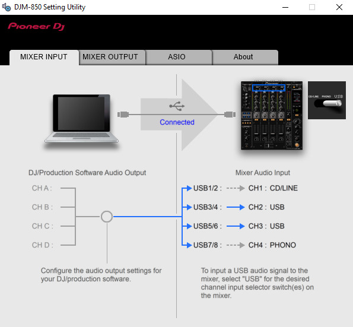

# Windows DJM-850 Setting Utility

This documentation explains what is the Windows DJM-850 Setting Utility, what
are its features and how it communicates with the device.

*Table of contents :*

- [Presentation](#presentation)
- [`Mixer input` tab](mixer-input-tab/README.md)
- [`Mixer output` tab](mixer-output-tab/README.md)
- [`ASIO` tab](asio-tab/README.md)
- [`About` tab](about-tab/README.md)
- [Plugging in the device](plugging-in-device/README.md)
- [Plugging out the device](plugging-out-device/README.md)
- [Setting Utility autolaunch](autolaunch.md)

## Presentation

The DJM-850 Setting Utility is installed when installing the device's Windows
driver. It is a GUI program which is launched when the device is plugged into
the computer.

This program is used to configure the mixer input and output routing hover USB,
the device soundcard frequency and samples rate. Each of these settings are
exposed in a dedicated tab on the GUI.

When launched, the Setting Utility regularly (i.e. more than once per second)
polls the device state, in order to update the displayed information in its
GUI. Additionally, it sends messages to the device when an option is chosen from
the GUI.

The wireshark capture files are quite noisy due to the polling behavior of the
Setting Utility, but we can easily apply some filters on the captured frames to
only display the ones we're interested into. You'll find the right filter to
apply in the documentation explaining the capture results.
