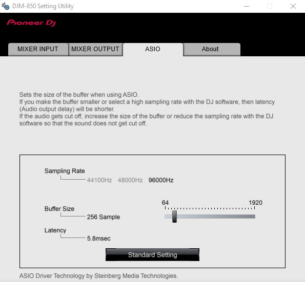
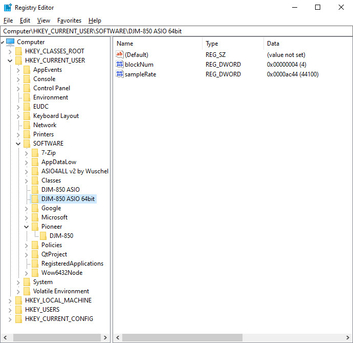

# `ASIO` tab

*Table of contents :*

- [Tab presentation](#tab-presentation)
- [USB frame capture workflow](#usb-frame-capture-workflow)
- [ASIO settings storage](#asio-settings-storage)
- [Interpretation](#interpretation)

## Tab presentation

The `ASIO` tab allow to set the [ASIO](https://en.wikipedia.org/wiki/Audio_Stream_Input/Output)
buffer size to use with the DJ software.

## USB frame capture workflow

I plugged the device into the computer and the Setting Utility has launched on
the VM. I started wireshark on the host and captured the USB traffic when
changing the `Buffer Size` option (only one change per capture).

I made a [first capture](captures/256_to_320_samples.pcapng) when changing the
buffer size from 256 samples (identified as the "Standard Setting" by the
Setting Utility) to 320 samples and I started to inspect it.

Unfortunately I saw no requests to the device containing such settings. So I
though that this information may not be transmitted to the device at all.

## ASIO settings storage

By digging into the Windows VM, I saw that there were informations in the
Windows registry at the key `Computer\HKEY_CURRENT_USER\SOFTWARE\DJM-850 ASIO` :

The `blockNum` number stores the `Buffer Size` option of the Setting Utility.
When the option is set to the smallest value (64 samples), the stored `blockNum`
value is `1`. When the option is set to the highest value (1920 samples), the
stored `blockNum` value is `30`.

We can deduce here that the stored `blockNum` value is a multiple of 64 samples.

The final buffer size used by the ASIO driver is `blockNum` * 64 samples.

There was an other Windows registry key at
`Computer\HKEY_CURRENT_USER\SOFTWARE\DJM-850 ASIO 64bit` for the 64 version of
the ASIO driver :

This registry has an additional `sampleRate` attribute which stores the plain
value of the sample rate, in Hz.

## Interpretation

I'm not sure about these settings or why they are stored that way. Maybe to
be used via a software which would use the DJM-850 ASIO driver and which doesn't
have the possibility to change them.

But generally, the DJ software offer the possibility to select the sound API
to use, as long as the sampling rate and the buffer size of the transmitted
audio.

So, in the end, I'm not really sure about the usage of this panel nor settings
for now.
