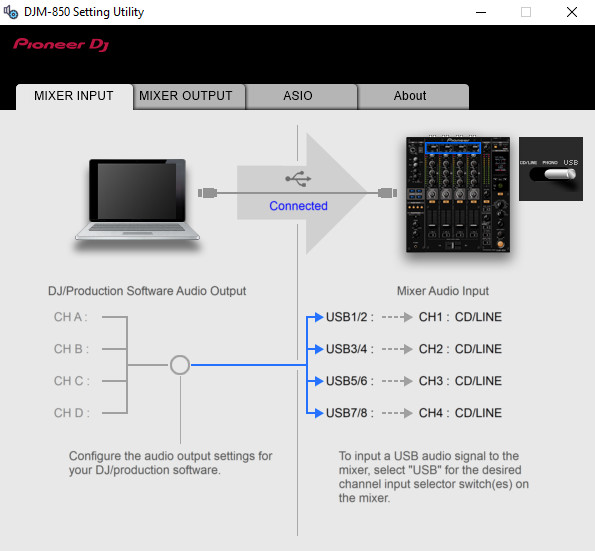
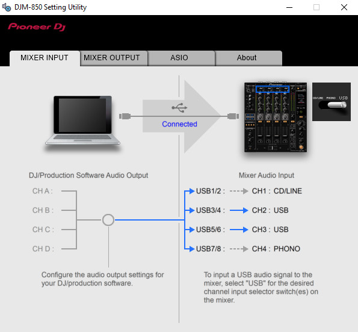

# `Mixer input` tab

*Table of contents :*

- [Tab presentation](#tab-presentation)
- [USB frame capture workflow](#usb-frame-capture-workflow)
- [Switches positions map](#switches-positions-map)
- [Frame details](#frame-details)
    - [Request](#request)
    - [Response](#response)
- [Implementation guide](#implementation-guide)
    - [Crafting requests](#crafting-requests)
    - [Reading responses](#reading-responses)

## Tab presentation

This tab displays the status of the channel input switches on the device, and
tells the user which channel can be used to input sound via USB.

For instance, when all the input switches are on the left position :



And when the ch1 switch is on the left, the ch2 & ch3 switches are on the right
and the ch4 switch is on the middle position :



From this, we can uderstand that the switches position information is
transmitted to the computer, whether when changing a switch or when the computer
polls the device for informations.

Actually, the study of the [captured USB frames](captures) reveals that it's
the second scenario which occurs (i.e. the Setting Utility regularly polls
the device for switches position information, more than once per second).
This also allow the Utility to determine the switches position when it is
launched and when no switches were moved yet.

## USB frame capture workflow

I first placed all the channel input switches to the left position, and started
to capture the USB frames just when moving a single switch off one position,
e.g. move ch1 switch from the left to the middle position. This would allow
to refine the search scope to only one change, and also to have short capture
times.

By looking at the [capture](captures/ch1/from_cdline_to_phono.pcapng), I saw the
polling `URB_CONTROL in` requests from the Settings Utility and the associated
responses from the device.

At the beginning of the capture, the response data was `00 00 00 00 00` (all
switches to the left), and at the end of the capture, the response data was
`00 03 00 00 00` (ch1 switch moved to the middle).

By looking at the other [captures](captures), I was able to determine that this
data represents the input switches position.
The data is stored on 5 bytes. I don't know what the first byte represents, but
the remaning 4 are representing the switch position for each channel.

To ease the reading of the capture files, you can use this wireshark filter :

```
usb.transfer_type == URB_CONTROL && usb.endpoint_address.direction == IN
```

## Switches positions map

From the [captures](captures), we can see that the switch position information
is transmitted as following :

| Switch Position | Byte value  |
| --------------- | ----------- |
| `CD/Line`       | `00`        |
| `Line`          | `01`        |
| `Phono`         | `03`        |
| `USB X/Y`       | `04`        |

And the channel to which belong this switch is determined by the position of the
byte in the response data :

```
00 00 00 00 00
|  |  |  |  |
|  |  |  |  +----> ch4
|  |  |  |
|  |  |  +-------> ch3
|  |  |
|  |  +----------> ch2
|  |
|  +-------------> ch1
|
+----------------> Unknown usage byte
```

So, in the following case :


the response data is `00 00 04 04 03`.

## Frame details

The frames are from the [`captures/ch1/from_cdline_to_phono.pcapng`](captures/ch1/from_cdline_to_phono.pcapng)
file.

### Request

USB frame sent by the Setting Utility to the device to request informations
about the input switches positions :

```
Frame 33: 64 bytes on wire (512 bits), 64 bytes captured (512 bits) on interface usbmon1, id 0
    Interface id: 0 (usbmon1)
        Interface name: usbmon1
    Encapsulation type: USB packets with Linux header and padding (115)
    Arrival Time: Feb 17, 2021 15:35:22.858189000 CET
    [Time shift for this packet: 0.000000000 seconds]
    Epoch Time: 1613572522.858189000 seconds
    [Time delta from previous captured frame: 0.003696000 seconds]
    [Time delta from previous displayed frame: 0.065677000 seconds]
    [Time since reference or first frame: 0.081254000 seconds]
    Frame Number: 33
    Frame Length: 64 bytes (512 bits)
    Capture Length: 64 bytes (512 bits)
    [Frame is marked: False]
    [Frame is ignored: False]
    [Protocols in frame: usb]
USB URB
    [Source: host]
    [Destination: 1.10.0]
    URB id: 0xffff8e6b498106c0
    URB type: URB_SUBMIT ('S')
    URB transfer type: URB_CONTROL (0x02)
    Endpoint: 0x80, Direction: IN
        1... .... = Direction: IN (1)
        .... 0000 = Endpoint number: 0
    Device: 10
    URB bus id: 1
    Device setup request: relevant (0)
    Data: not present ('<')
    URB sec: 1613572522
    URB usec: 858189
    URB status: Operation now in progress (-EINPROGRESS) (-115)
    URB length [bytes]: 5
    Data length [bytes]: 0
    [Response in: 34]
    Interval: 0
    Start frame: 0
    Copy of Transfer Flags: 0x00000200, Dir IN
        .... .... .... .... .... .... .... ...0 = Short not OK: False
        .... .... .... .... .... .... .... ..0. = ISO ASAP: False
        .... .... .... .... .... .... .... .0.. = No transfer DMA map: False
        .... .... .... .... .... .... ..0. .... = No FSBR: False
        .... .... .... .... .... .... .0.. .... = Zero Packet: False
        .... .... .... .... .... .... 0... .... = No Interrupt: False
        .... .... .... .... .... ...0 .... .... = Free Buffer: False
        .... .... .... .... .... ..1. .... .... = Dir IN: True
        .... .... .... ...0 .... .... .... .... = DMA Map Single: False
        .... .... .... ..0. .... .... .... .... = DMA Map Page: False
        .... .... .... .0.. .... .... .... .... = DMA Map SG: False
        .... .... .... 0... .... .... .... .... = Map Local: False
        .... .... ...0 .... .... .... .... .... = Setup Map Single: False
        .... .... ..0. .... .... .... .... .... = Setup Map Local: False
        .... .... .0.. .... .... .... .... .... = DMA S-G Combined: False
        .... .... 0... .... .... .... .... .... = Aligned Temp Buffer: False
    Number of ISO descriptors: 0
    [bInterfaceClass: Unknown (0xffff)]
Setup Data
    bmRequestType: 0xc0
        1... .... = Direction: Device-to-host
        .10. .... = Type: Vendor (0x2)
        ...0 0000 = Recipient: Device (0x00)
    bRequest: 0
    wValue: 0x0000
    wIndex: 32770 (0x8002)
    wLength: 5
```

### Response

USB frame sent by the device as a response to the Service Utility request about
the input switches positions :

```
Frame 34: 69 bytes on wire (552 bits), 69 bytes captured (552 bits) on interface usbmon1, id 0
    Interface id: 0 (usbmon1)
        Interface name: usbmon1
    Encapsulation type: USB packets with Linux header and padding (115)
    Arrival Time: Feb 17, 2021 15:35:22.858280000 CET
    [Time shift for this packet: 0.000000000 seconds]
    Epoch Time: 1613572522.858280000 seconds
    [Time delta from previous captured frame: 0.000091000 seconds]
    [Time delta from previous displayed frame: 0.000091000 seconds]
    [Time since reference or first frame: 0.081345000 seconds]
    Frame Number: 34
    Frame Length: 69 bytes (552 bits)
    Capture Length: 69 bytes (552 bits)
    [Frame is marked: False]
    [Frame is ignored: False]
    [Protocols in frame: usb]
USB URB
    [Source: 1.10.0]
    [Destination: host]
    URB id: 0xffff8e6b498106c0
    URB type: URB_COMPLETE ('C')
    URB transfer type: URB_CONTROL (0x02)
    Endpoint: 0x80, Direction: IN
        1... .... = Direction: IN (1)
        .... 0000 = Endpoint number: 0
    Device: 10
    URB bus id: 1
    Device setup request: not relevant ('-')
    Data: present (0)
    URB sec: 1613572522
    URB usec: 858280
    URB status: Success (0)
    URB length [bytes]: 5
    Data length [bytes]: 5
    [Request in: 33]
    [Time from request: 0.000091000 seconds]
    Unused Setup Header
    Interval: 0
    Start frame: 0
    Copy of Transfer Flags: 0x00000200, Dir IN
        .... .... .... .... .... .... .... ...0 = Short not OK: False
        .... .... .... .... .... .... .... ..0. = ISO ASAP: False
        .... .... .... .... .... .... .... .0.. = No transfer DMA map: False
        .... .... .... .... .... .... ..0. .... = No FSBR: False
        .... .... .... .... .... .... .0.. .... = Zero Packet: False
        .... .... .... .... .... .... 0... .... = No Interrupt: False
        .... .... .... .... .... ...0 .... .... = Free Buffer: False
        .... .... .... .... .... ..1. .... .... = Dir IN: True
        .... .... .... ...0 .... .... .... .... = DMA Map Single: False
        .... .... .... ..0. .... .... .... .... = DMA Map Page: False
        .... .... .... .0.. .... .... .... .... = DMA Map SG: False
        .... .... .... 0... .... .... .... .... = Map Local: False
        .... .... ...0 .... .... .... .... .... = Setup Map Single: False
        .... .... ..0. .... .... .... .... .... = Setup Map Local: False
        .... .... .0.. .... .... .... .... .... = DMA S-G Combined: False
        .... .... 0... .... .... .... .... .... = Aligned Temp Buffer: False
    Number of ISO descriptors: 0
    [bInterfaceClass: Unknown (0xffff)]
CONTROL response data: 0000000000
```

Notice the `CONTROL response data: 0000000000` line at the end which is the
response data. Here, it indicates that all the switches are on the left
(`CD/Line` position). See the [switches positions map](#switches-positions-map)
chapter for more details.

## Implementation guide

From the above frame details and response data analysis, we can issue some
details in order to implement the features of the `Mixer input` tab.

### Crafting requests

In order to get the input switches positions, we have to send a request to the
DJM-850 having the following URB attributes :

```
USB URB
    URB type: URB_SUBMIT ('S')
    URB transfer type: URB_CONTROL (0x02)
    Endpoint: 0x80, Direction: IN
        1... .... = Direction: IN (1)
        .... 0000 = Endpoint number: 0
    URB length [bytes]: 5
    Data length [bytes]: 0
Setup Data
    bmRequestType: 0xc0
        1... .... = Direction: Device-to-host
        .10. .... = Type: Vendor (0x2)
        ...0 0000 = Recipient: Device (0x00)
    bRequest: 0
    wValue: 0x0000
    wIndex: 32770 (0x8002)
    wLength: 5
```

### Reading responses

The response from the device should contain the following attributes :

```
USB URB
    URB type: URB_COMPLETE ('C')
    URB transfer type: URB_CONTROL (0x02)
    Endpoint: 0x80, Direction: IN
        1... .... = Direction: IN (1)
        .... 0000 = Endpoint number: 0
    URB status: Success (0)
    URB length [bytes]: 5
    Data length [bytes]: 5
CONTROL response data: 0000000000
```

Where the `CONTROL response data` is the information about input switches
positions (see the [switches positions map](#switches-positions-map) chapter
for more details).
