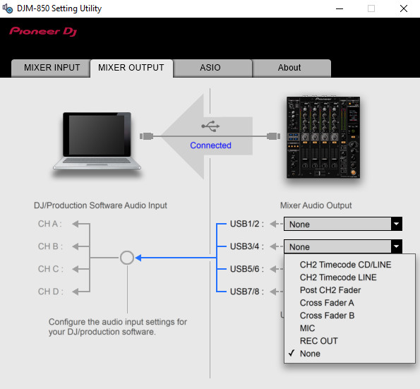
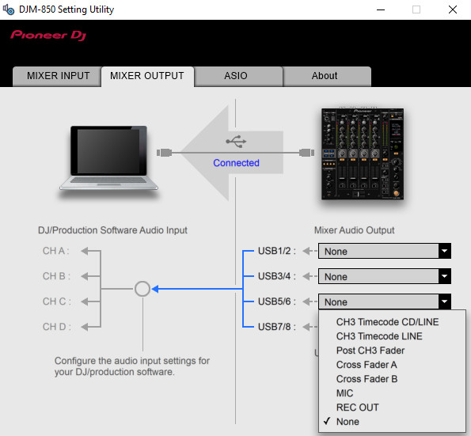
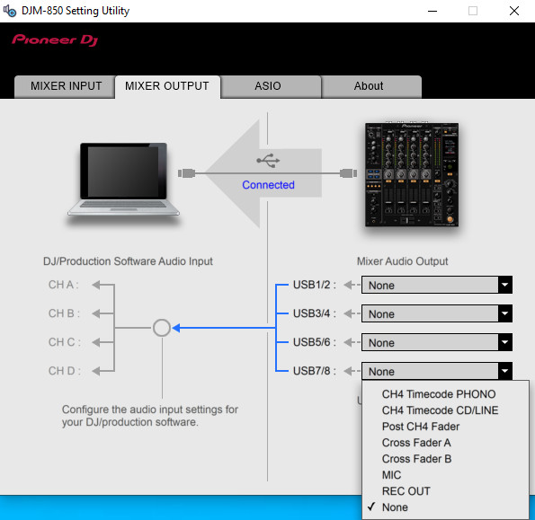
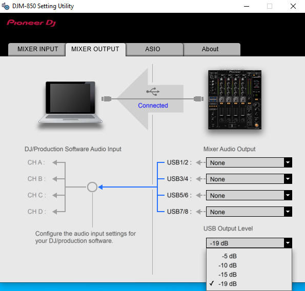

# `Mixer output` tab

*Table of contents :*

- [Tab presentation](#tab-presentation)
- [USB frame capture workflow](#usb-frame-capture-workflow)
- [Selected options storage map](#selected-options-storage-map)
    - [USB output audio routing map](#usb-output-audio-routing-map)
    - [USB output level map](#usb-output-level-map)
- [Frame details](#frame-details)
    - [USB output audio routing request](#usb-output-audio-routing-request)
    - [USB output audio routing response](#usb-output-audio-routing-response)
    - [USB output level request](#usb-output-level-request)
    - [USB output level response](#usb-output-level-response)
- [Implementation guide](#implementation-guide)
    - [Crafting requests to set USB output audio routing](#crafting-requests-to-set-usb-output-audio-routing)
    - [Crafting requests to set USB output level](#crafting-requests-to-set-usb-output-level)
    - [Reading responses](#reading-responses)

## Tab presentation

This tab offers options to route the mixer audio to USB output.
It also allows to set the USB output level, in dB.

Each USB output has the corresponding audio routing options :








And the USB output level has the following options :



We can now suppose that there is a way to transmit these options settings from
the computer to the device, in order to tell the device from which source to
route audio to the USB output.

## USB frame capture workflow

For each USB output, I placed the audio routing option on `None`, and I captured
the USB traffic when changing the option from `None` to another one from the
list. I then repeated this capture for each options of the list, and finally,
to capture the change for the `None` option, I initially set the option to
`CHX Timecode CD/LINE`.

For the USB output level options, I used the same principle : one capture per
option change.

All the captures are available in the [captures](captures) directory. They are
still noisy due to the polling behavior of the Setting Utility in order to
determine the position of the input switches for the
[`Mixer input` tab](../mixer-input-tab/README.md).

However, by looking at [one of the captures](captures/usb12/none_to_timecode_cdline.pcapng),
I saw that there were `URB_CONTROL out` request and response.

To ease the reading of the capture files, you can use this wireshark filter :

```
usb.transfer_type == URB_CONTROL && usb.endpoint_address.direction == OUT
```

## Selected options storage map

By comparing the payload of the request in each capture files, I was able to
determine how the Setting Utility was sending the options informations to the
device.

### USB output audio routing map

The information for the USB output audio routing is stored in the `wValue` field
of the URB request payload, with a fixed value for the `wIndex` field :

```
wValue: 0x0100
wIndex: 32770 (0x8002)
```

The `wValue` value is stored on two bytes (`0xAABB`) where the first byte (`AA`)
is the USB output number, and the second byte (`BB`) is the routing option
value.

By looking at the [USB output audio routing captures](captures), we can see that
the selected options are transmitted as following :

| USB output number | `wValue` first byte value (`AA`) |
| ----------------- | -------------------------------- |
| `1/2`             | `01`                             |
| `3/4`             | `02`                             |
| `5/6`             | `03`                             |
| `7/8`             | `04`                             |

| Audio routing source   | `wValue` second byte value (`BB`) |
| ---------------------- | --------------------------------- |
| `CHX Timecode PHONO`   | `03`                              |
| `CHX Timecode CD/LINE` | `00`                              |
| `CHX Timecode LINE`    | `01`                              |
| `Post CHX Fader`       | `06`                              |
| `Cross Fader A`        | `07`                              |
| `Cross Fader B`        | `08`                              |
| `MIC`                  | `09`                              |
| `REC OUT`              | `0a`                              |
| `None`                 | `0f`                              |

So, for instance, `wValue: 0x0100` means that the `USB 1/2` output has the
`CHX Timecode CD/LINE` audio source.

### USB output level map

The information for the USB output level is also stored in the `wValue` field of
the URB request payload, with another fixed value for the `wIndex` field :

```
wValue: 0x0300
wIndex: 32771 (0x8003)
```

This time, only the first byte of the `wValue` field is used to store the
selected option, the second byte is always set to `00` : `0xAA00`.

By looking at the [USB output level captures](captures/usb_output_level), we can
see that the selected option is transmitted as following :

| USB output level | `wValue` first byte value (`AA`) |
| ---------------- | -------------------------------- |
| `-5dB`           | `03`                             |
| `-10dB`          | `02`                             |
| `-15dB`          | `01`                             |
| `-19dB`          | `00`                             |

So, for instance, `wValue: 0x0300` means that the USB output level is set to
`-5dB`.

## Frame details

The USB output audio routing frames are from the
[`captures/usb12/none_to_timecode_cdline.pcapng`](captures/usb12/none_to_timecode_cdline.pcapng)
file.

The USB output level frames are from the
[`captures/usb_output_level/-19dB_to_-5dB.pcapng`](captures/usb_output_level/-19dB_to_-5dB.pcapng)
file.

### USB output audio routing request

USB frame sent by the Setting Utility to the device to set the `USB 1/2` output
audio source to `CHX Timecode CD/Line` :

```
Frame 145: 64 bytes on wire (512 bits), 64 bytes captured (512 bits) on interface usbmon1, id 0
    Interface id: 0 (usbmon1)
        Interface name: usbmon1
    Encapsulation type: USB packets with Linux header and padding (115)
    Arrival Time: Feb 17, 2021 18:57:46.584375000 CET
    [Time shift for this packet: 0.000000000 seconds]
    Epoch Time: 1613584666.584375000 seconds
    [Time delta from previous captured frame: 0.007645000 seconds]
    [Time delta from previous displayed frame: 0.000000000 seconds]
    [Time since reference or first frame: 1.031065000 seconds]
    Frame Number: 145
    Frame Length: 64 bytes (512 bits)
    Capture Length: 64 bytes (512 bits)
    [Frame is marked: False]
    [Frame is ignored: False]
    [Protocols in frame: usb]
USB URB
    [Source: host]
    [Destination: 1.12.0]
    URB id: 0xffff8e6b45d66900
    URB type: URB_SUBMIT ('S')
    URB transfer type: URB_CONTROL (0x02)
    Endpoint: 0x00, Direction: OUT
        0... .... = Direction: OUT (0)
        .... 0000 = Endpoint number: 0
    Device: 12
    URB bus id: 1
    Device setup request: relevant (0)
    Data: present (0)
    URB sec: 1613584666
    URB usec: 584375
    URB status: Operation now in progress (-EINPROGRESS) (-115)
    URB length [bytes]: 0
    Data length [bytes]: 0
    [Response in: 146]
    Interval: 0
    Start frame: 0
    Copy of Transfer Flags: 0x00000000
        .... .... .... .... .... .... .... ...0 = Short not OK: False
        .... .... .... .... .... .... .... ..0. = ISO ASAP: False
        .... .... .... .... .... .... .... .0.. = No transfer DMA map: False
        .... .... .... .... .... .... ..0. .... = No FSBR: False
        .... .... .... .... .... .... .0.. .... = Zero Packet: False
        .... .... .... .... .... .... 0... .... = No Interrupt: False
        .... .... .... .... .... ...0 .... .... = Free Buffer: False
        .... .... .... .... .... ..0. .... .... = Dir IN: False
        .... .... .... ...0 .... .... .... .... = DMA Map Single: False
        .... .... .... ..0. .... .... .... .... = DMA Map Page: False
        .... .... .... .0.. .... .... .... .... = DMA Map SG: False
        .... .... .... 0... .... .... .... .... = Map Local: False
        .... .... ...0 .... .... .... .... .... = Setup Map Single: False
        .... .... ..0. .... .... .... .... .... = Setup Map Local: False
        .... .... .0.. .... .... .... .... .... = DMA S-G Combined: False
        .... .... 0... .... .... .... .... .... = Aligned Temp Buffer: False
    Number of ISO descriptors: 0
    [bInterfaceClass: Unknown (0xffff)]
Setup Data
    bmRequestType: 0x40
        0... .... = Direction: Host-to-device
        .10. .... = Type: Vendor (0x2)
        ...0 0000 = Recipient: Device (0x00)
    bRequest: 3
    wValue: 0x0100
    wIndex: 32770 (0x8002)
    wLength: 0
```

### USB output audio routing response

USB frame sent by the device to the Utility Setting to aknowledge the USB output
audio routing setting :

```
Frame 146: 64 bytes on wire (512 bits), 64 bytes captured (512 bits) on interface usbmon1, id 0
    Interface id: 0 (usbmon1)
        Interface name: usbmon1
    Encapsulation type: USB packets with Linux header and padding (115)
    Arrival Time: Feb 17, 2021 18:57:46.584451000 CET
    [Time shift for this packet: 0.000000000 seconds]
    Epoch Time: 1613584666.584451000 seconds
    [Time delta from previous captured frame: 0.000076000 seconds]
    [Time delta from previous displayed frame: 0.000076000 seconds]
    [Time since reference or first frame: 1.031141000 seconds]
    Frame Number: 146
    Frame Length: 64 bytes (512 bits)
    Capture Length: 64 bytes (512 bits)
    [Frame is marked: False]
    [Frame is ignored: False]
    [Protocols in frame: usb]
USB URB
    [Source: 1.12.0]
    [Destination: host]
    URB id: 0xffff8e6b45d66900
    URB type: URB_COMPLETE ('C')
    URB transfer type: URB_CONTROL (0x02)
    Endpoint: 0x00, Direction: OUT
        0... .... = Direction: OUT (0)
        .... 0000 = Endpoint number: 0
    Device: 12
    URB bus id: 1
    Device setup request: not relevant ('-')
    Data: not present ('>')
    URB sec: 1613584666
    URB usec: 584451
    URB status: Success (0)
    URB length [bytes]: 0
    Data length [bytes]: 0
    [Request in: 145]
    [Time from request: 0.000076000 seconds]
    Unused Setup Header
    Interval: 0
    Start frame: 0
    Copy of Transfer Flags: 0x00000000
        .... .... .... .... .... .... .... ...0 = Short not OK: False
        .... .... .... .... .... .... .... ..0. = ISO ASAP: False
        .... .... .... .... .... .... .... .0.. = No transfer DMA map: False
        .... .... .... .... .... .... ..0. .... = No FSBR: False
        .... .... .... .... .... .... .0.. .... = Zero Packet: False
        .... .... .... .... .... .... 0... .... = No Interrupt: False
        .... .... .... .... .... ...0 .... .... = Free Buffer: False
        .... .... .... .... .... ..0. .... .... = Dir IN: False
        .... .... .... ...0 .... .... .... .... = DMA Map Single: False
        .... .... .... ..0. .... .... .... .... = DMA Map Page: False
        .... .... .... .0.. .... .... .... .... = DMA Map SG: False
        .... .... .... 0... .... .... .... .... = Map Local: False
        .... .... ...0 .... .... .... .... .... = Setup Map Single: False
        .... .... ..0. .... .... .... .... .... = Setup Map Local: False
        .... .... .0.. .... .... .... .... .... = DMA S-G Combined: False
        .... .... 0... .... .... .... .... .... = Aligned Temp Buffer: False
    Number of ISO descriptors: 0
    [bInterfaceClass: Unknown (0xffff)]
```

### USB output level request

USB frame sent by the Setting Utility to the device to set the USB output level
to `-5dB` :

```
Frame 409: 64 bytes on wire (512 bits), 64 bytes captured (512 bits) on interface usbmon1, id 0
    Interface id: 0 (usbmon1)
        Interface name: usbmon1
    Encapsulation type: USB packets with Linux header and padding (115)
    Arrival Time: Feb 17, 2021 19:21:51.626988000 CET
    [Time shift for this packet: 0.000000000 seconds]
    Epoch Time: 1613586111.626988000 seconds
    [Time delta from previous captured frame: 0.015503000 seconds]
    [Time delta from previous displayed frame: 0.347120000 seconds]
    [Time since reference or first frame: 3.067756000 seconds]
    Frame Number: 409
    Frame Length: 64 bytes (512 bits)
    Capture Length: 64 bytes (512 bits)
    [Frame is marked: False]
    [Frame is ignored: False]
    [Protocols in frame: usb]
USB URB
    [Source: host]
    [Destination: 1.12.0]
    URB id: 0xffff8e6baf2a3600
    URB type: URB_SUBMIT ('S')
    URB transfer type: URB_CONTROL (0x02)
    Endpoint: 0x00, Direction: OUT
        0... .... = Direction: OUT (0)
        .... 0000 = Endpoint number: 0
    Device: 12
    URB bus id: 1
    Device setup request: relevant (0)
    Data: present (0)
    URB sec: 1613586111
    URB usec: 626988
    URB status: Operation now in progress (-EINPROGRESS) (-115)
    URB length [bytes]: 0
    Data length [bytes]: 0
    [Response in: 410]
    Interval: 0
    Start frame: 0
    Copy of Transfer Flags: 0x00000000
        .... .... .... .... .... .... .... ...0 = Short not OK: False
        .... .... .... .... .... .... .... ..0. = ISO ASAP: False
        .... .... .... .... .... .... .... .0.. = No transfer DMA map: False
        .... .... .... .... .... .... ..0. .... = No FSBR: False
        .... .... .... .... .... .... .0.. .... = Zero Packet: False
        .... .... .... .... .... .... 0... .... = No Interrupt: False
        .... .... .... .... .... ...0 .... .... = Free Buffer: False
        .... .... .... .... .... ..0. .... .... = Dir IN: False
        .... .... .... ...0 .... .... .... .... = DMA Map Single: False
        .... .... .... ..0. .... .... .... .... = DMA Map Page: False
        .... .... .... .0.. .... .... .... .... = DMA Map SG: False
        .... .... .... 0... .... .... .... .... = Map Local: False
        .... .... ...0 .... .... .... .... .... = Setup Map Single: False
        .... .... ..0. .... .... .... .... .... = Setup Map Local: False
        .... .... .0.. .... .... .... .... .... = DMA S-G Combined: False
        .... .... 0... .... .... .... .... .... = Aligned Temp Buffer: False
    Number of ISO descriptors: 0
    [bInterfaceClass: Unknown (0xffff)]
Setup Data
    bmRequestType: 0x40
        0... .... = Direction: Host-to-device
        .10. .... = Type: Vendor (0x2)
        ...0 0000 = Recipient: Device (0x00)
    bRequest: 3
    wValue: 0x0300
    wIndex: 32771 (0x8003)
    wLength: 0
```

### USB output level response

USB frame sent by the device to the Utility Setting to aknowledge the USB output
level setting :

```
Frame 410: 64 bytes on wire (512 bits), 64 bytes captured (512 bits) on interface usbmon1, id 0
    Interface id: 0 (usbmon1)
        Interface name: usbmon1
    Encapsulation type: USB packets with Linux header and padding (115)
    Arrival Time: Feb 17, 2021 19:21:51.627124000 CET
    [Time shift for this packet: 0.000000000 seconds]
    Epoch Time: 1613586111.627124000 seconds
    [Time delta from previous captured frame: 0.000136000 seconds]
    [Time delta from previous displayed frame: 0.000136000 seconds]
    [Time since reference or first frame: 3.067892000 seconds]
    Frame Number: 410
    Frame Length: 64 bytes (512 bits)
    Capture Length: 64 bytes (512 bits)
    [Frame is marked: False]
    [Frame is ignored: False]
    [Protocols in frame: usb]
USB URB
    [Source: 1.12.0]
    [Destination: host]
    URB id: 0xffff8e6baf2a3600
    URB type: URB_COMPLETE ('C')
    URB transfer type: URB_CONTROL (0x02)
    Endpoint: 0x00, Direction: OUT
        0... .... = Direction: OUT (0)
        .... 0000 = Endpoint number: 0
    Device: 12
    URB bus id: 1
    Device setup request: not relevant ('-')
    Data: not present ('>')
    URB sec: 1613586111
    URB usec: 627124
    URB status: Success (0)
    URB length [bytes]: 0
    Data length [bytes]: 0
    [Request in: 409]
    [Time from request: 0.000136000 seconds]
    Unused Setup Header
    Interval: 0
    Start frame: 0
    Copy of Transfer Flags: 0x00000000
        .... .... .... .... .... .... .... ...0 = Short not OK: False
        .... .... .... .... .... .... .... ..0. = ISO ASAP: False
        .... .... .... .... .... .... .... .0.. = No transfer DMA map: False
        .... .... .... .... .... .... ..0. .... = No FSBR: False
        .... .... .... .... .... .... .0.. .... = Zero Packet: False
        .... .... .... .... .... .... 0... .... = No Interrupt: False
        .... .... .... .... .... ...0 .... .... = Free Buffer: False
        .... .... .... .... .... ..0. .... .... = Dir IN: False
        .... .... .... ...0 .... .... .... .... = DMA Map Single: False
        .... .... .... ..0. .... .... .... .... = DMA Map Page: False
        .... .... .... .0.. .... .... .... .... = DMA Map SG: False
        .... .... .... 0... .... .... .... .... = Map Local: False
        .... .... ...0 .... .... .... .... .... = Setup Map Single: False
        .... .... ..0. .... .... .... .... .... = Setup Map Local: False
        .... .... .0.. .... .... .... .... .... = DMA S-G Combined: False
        .... .... 0... .... .... .... .... .... = Aligned Temp Buffer: False
    Number of ISO descriptors: 0
    [bInterfaceClass: Unknown (0xffff)]
```

## Implementation guide

From the above frame details and response data analysis, we can issue some
details in order to implement the features of the `Mixer output` tab.

### Crafting requests to set USB output audio routing

In order to set the USB output audio routing, we have to send a URB request to
the device having the following attributes :

```
USB URB
    URB type: URB_SUBMIT ('S')
    URB transfer type: URB_CONTROL (0x02)
    Endpoint: 0x00, Direction: OUT
        0... .... = Direction: OUT (0)
        .... 0000 = Endpoint number: 0
    URB length [bytes]: 0
    Data length [bytes]: 0
Setup Data
    bmRequestType: 0x40
        0... .... = Direction: Host-to-device
        .10. .... = Type: Vendor (0x2)
        ...0 0000 = Recipient: Device (0x00)
    bRequest: 3
    wValue: 0x0100
    wIndex: 32770 (0x8002)
    wLength: 0
```

Refer to the [USB output audio routing map](#usb-output-audio-routing-map)
in order to determine the value of the `wValue` attribute.
Also consider that not all USB outputs have the same option choices (c.f. the
screenshots in the [tab presentation](#tab-presentation)).

### Crafting requests to set USB output level

In order to set the USB output level, we have to send a URB request to
the device having the following attributes :

```
USB URB
    URB type: URB_SUBMIT ('S')
    URB transfer type: URB_CONTROL (0x02)
    Endpoint: 0x00, Direction: OUT
        0... .... = Direction: OUT (0)
        .... 0000 = Endpoint number: 0
    URB length [bytes]: 0
    Data length [bytes]: 0
Setup Data
    bmRequestType: 0x40
        0... .... = Direction: Host-to-device
        .10. .... = Type: Vendor (0x2)
        ...0 0000 = Recipient: Device (0x00)
    bRequest: 3
    wValue: 0x0300
    wIndex: 32771 (0x8003)
    wLength: 0
```

Refer to the [USB output level map](#usb-output-level-map)
in order to determine the value of the `wValue` attribute.

### Reading responses

The response from the device should contain the following attributes :

```
USB URB
    URB type: URB_COMPLETE ('C')
    URB transfer type: URB_CONTROL (0x02)
    Endpoint: 0x00, Direction: OUT
        0... .... = Direction: OUT (0)
        .... 0000 = Endpoint number: 0
    URB status: Success (0)
    URB length [bytes]: 0
    Data length [bytes]: 0
```
