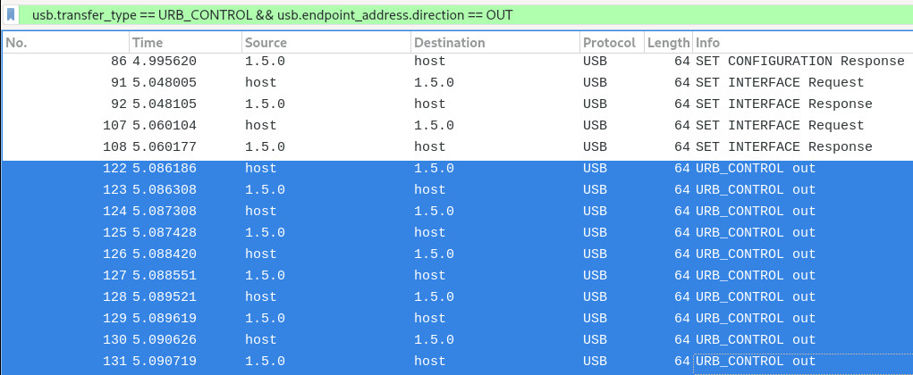
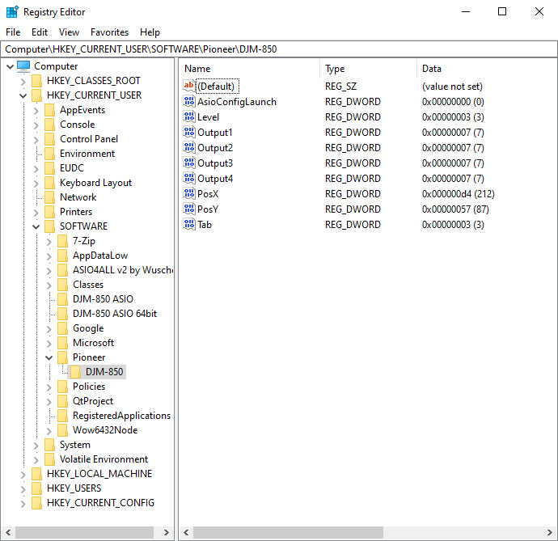

# Plugging in the device

*Table of contents :*

- [Presentation](#presentation)
- [USB frame capture workflow](#usb-frame-capture-workflow)
- [Discussion details](#discussion-details)
- [Configuration storage](#configuration-storage)
- [Implementation](#implementation)

## Presentation

This document describes the study of the communication between the computer and
the device when the device gets plugged into the computer. It also explains the
study results.

## USB frame capture workflow

In order to capture the discussion between the computer and the device, I first
plugged the device into the host machine, but I let it unplugged into the
Windows VM (unticked checkbox in the VirtualBox's
`Devices -> USB -> Pioneer DJM-850` menu).

Then, I started to capture usb frames on the host using wireshark, and I ticked
the `Devices -> USB -> Pioneer DJM-850` checkbox of the VM in order to connect
the device to the VM. The Setting Utility program showed up on the VM, and I
stopped the wireshark capture a few seconds later.

## Discussion details

As we can see in the [capture file](captures/plug_in.pcapng), the Setting
Utility starts to poll the device to gather data for the
[`Mixer input` tab](../mixer-input-tab/README.md).

Additionally, we can see a discussion similar to the behavior of the
[`Mixer output` tab](../mixer-output-tab/README.md), where the Setting Utility
tells the device what are the selected options for USB output.

You can use this wireshark filter to see these requests :

```
usb.transfer_type == URB_CONTROL && usb.endpoint_address.direction == OUT
```



The Setting Utility is able to send the latest configured options for USB
output when it launches, which means that it is also able to store these options
on the computer, in order to send them to the device for the next launch.

## Configuration storage

By digging into the Windows WM, I saw that the USB output options were stored
into the Windows registry at the
`Computer\HKEY_CURRENT_USER\SOFTWARE\Pioneer\DJM-850` key, alongside to other
settings :



Here are the config details :

| Parameter name     | Description                                                               |
| ------------------ | ----------------------------------------------------------------          |
| `AsioConfigLaunch` | Unknown parameter.                                                        |
| `Level`            | Stores the `USB output level` option.                                     |
| `Output1`          | Stores the `USB 1/2 output audio source` option.                          |
| `Output2`          | Stores the `USB 3/4 output audio source` option.                          |
| `Output3`          | Stores the `USB 5/6 output audio source` option.                          |
| `Output4`          | Stores the `USB 7/8 output audio source` option.                          |
| `PosX`             | Stores the position of the Setting Utility window on the X axis.          |
| `PosY`             | Stores the position of the Setting Utility window on the Y axis.          |
| `Tab`              | Stores the latest viewed tab of the Setting Utility (`0`, `1`, `2`, `3`). |

Note that the stored values here for the USB output options differ from the
values sent to the device. I don't know why the values differ, but this is an
implementation detail of the way the Setting Utility stores the config, and what
really matters here is that we are now aware that this config is stored.

## Implementation

The clone of the Setting Utility should also send the latest used USB output
configuration to the device when it launches and the device is plugged in.

In order to do so, the clone should save the configured USB output options when
it gets closed.
We can think to a simple text file (e.g. yaml) to store this config, as it would
stick to the Unix philosophy (*all is file*), and would also be human readable.
The config file could directly store the values to send to the device.
The clone would make sure that the values are valid, otherwise it would use
default values (i.e. `None` option for USB output audio source, and `-19dB`
option for USB output audio level).
The default values should also be used in case where the config file is not
present. The config file should be stored in the user's home directory, i.e.
`~/.DJM-850/config.yml`.
