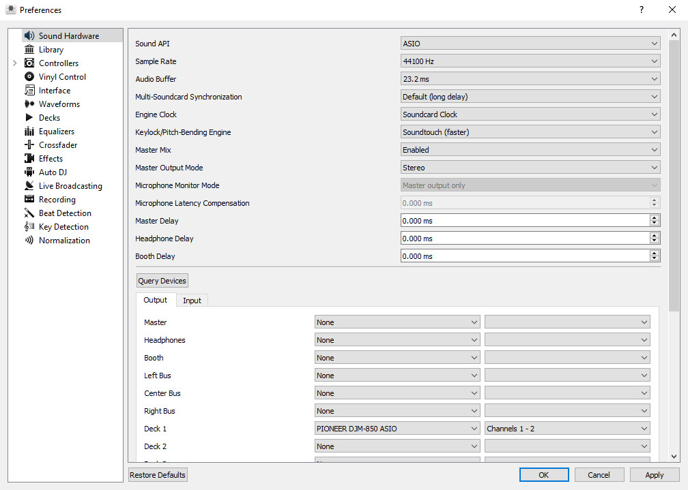
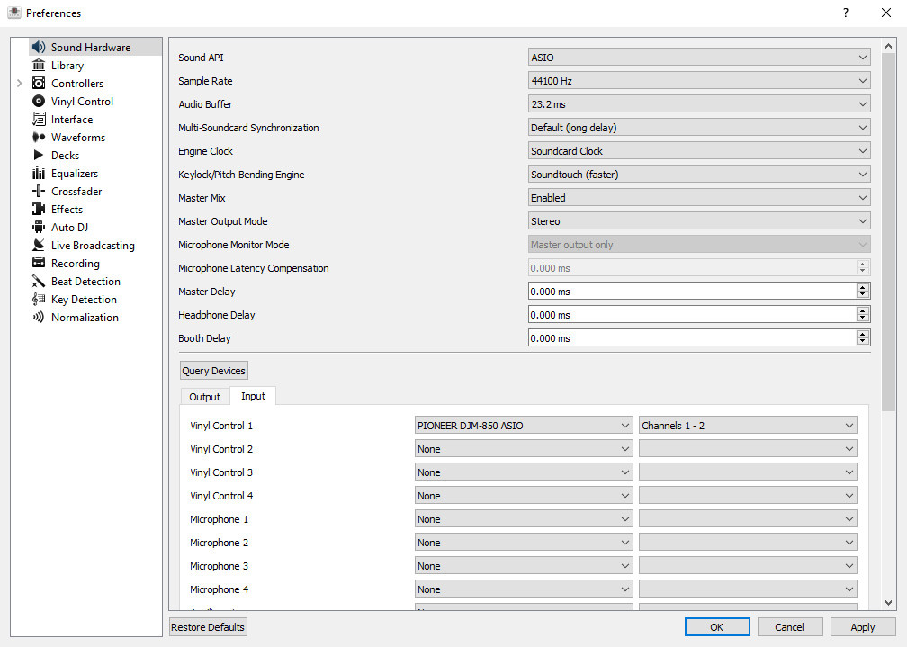
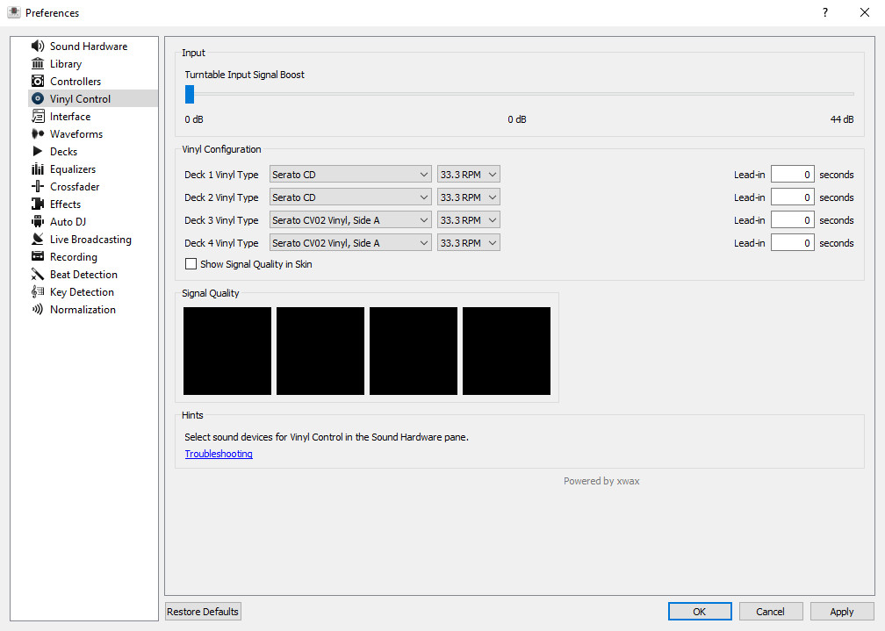
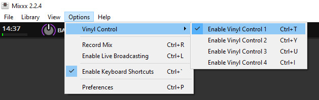

# Timecode and music signals transfer

*Table of contents :*

- [USB frame capture workflow](#usb-frame-capture-workflow)
- [Frame details](#frame-details)
    - [Timecode signal request](#timecode-signal-request)
    - [Timecode signal response](#timecode-signal-response)
    - [Music signal push](#music-signal-push)
    - [Music signal response](#music-signal-response)
- [Timecode and music streams](#timecode-and-music-streams)
- [Implementation guide](#implementation-guide)
    - [Requesting timecode signal](#requesting-timecode-signal)
    - [Receiving timecode signal](#receiving-timecode-signal)
    - [Sending music signal](#sending-music-signal)
    - [Music signal received](#music-signal-received)

## USB frame capture workflow

In order to capture the USB traffic for DVS usage, I used a single channel on
the mixer (ch1, USB 1/2), and then configured the DJ software on the Windows VM
([Mixxx](https://mixxx.org/)) to enable vinyl control on the deck where the
music was loaded :





I used a Serato CD signal, generated by a Denon SC3900 deck. Mixxx was also
configured to handle this signal :





I then started the playback on the SC3900, the DVS system was working and the
music signal was sent back to the mixer. Once I've got the music playing, I
started to capture the USB traffic with wireshark on my GNU/Linux host.

From there, I saw that the mixer and the computer were talking by using
`URB_ISOCHRONOUS` frames, which are generally used to stream data such as audio
or video. Such frame types do not assert if the transmitted data is received
correctly (it makes me think a bit to `UDP` on this point), the main goal is to
be able to transfer chunks of data, and it's not compromising if a chunk gets
lost (it'll only cut the sound a bit).

You can see the capture file there : [`../common-captures/usb12_lrinput_lroutput_23.2msbuffer_44100Hz.pcapng`](../common-captures/usb12_lrinput_lroutput_23.2msbuffer_44100Hz.pcapng).
The capture duration is about 3 seconds. We can see that there are a lot of
messages, due to the framerate and buffer samples size.

## Frame details

This chapter details how the timecode signal is received, and how the music
signal is sent.

### Timecode signal request

The timecode signal is polled from the device by the computer. The computer
sends the following `URB_ISOCHRONOUS in` request to the device on endpoint `6`,
in order to request the timecode signal :

```
Frame 1000: 192 bytes on wire (1536 bits), 192 bytes captured (1536 bits) on interface usbmon1, id 0
    Interface id: 0 (usbmon1)
        Interface name: usbmon1
    Encapsulation type: USB packets with Linux header and padding (115)
    Arrival Time: Feb 20, 2021 21:00:54.366906000 CET
    [Time shift for this packet: 0.000000000 seconds]
    Epoch Time: 1613851254.366906000 seconds
    [Time delta from previous captured frame: 0.000022000 seconds]
    [Time delta from previous displayed frame: 0.000022000 seconds]
    [Time since reference or first frame: 0.230182000 seconds]
    Frame Number: 1000
    Frame Length: 192 bytes (1536 bits)
    Capture Length: 192 bytes (1536 bits)
    [Frame is marked: False]
    [Frame is ignored: False]
    [Protocols in frame: usb]
USB URB
    [Source: host]
    [Destination: 1.4.6]
    URB id: 0xffff953084734e00
    URB type: URB_SUBMIT ('S')
    URB transfer type: URB_ISOCHRONOUS (0x00)
    Endpoint: 0x86, Direction: IN
        1... .... = Direction: IN (1)
        .... 0110 = Endpoint number: 6
    Device: 4
    URB bus id: 1
    Device setup request: not relevant ('-')
    Data: not present ('<')
    URB sec: 1613851254
    URB usec: 366906
    URB status: Operation now in progress (-EINPROGRESS) (-115)
    URB length [bytes]: 1728
    Data length [bytes]: 128
    [Response in: 1031]
    [bInterfaceClass: Vendor Specific (0xff)]
    ISO error count: 0
    Number of ISO descriptors: 8
    Interval: 1
    Start frame: 0
    Copy of Transfer Flags: 0x00000202, ISO ASAP, Dir IN
        .... .... .... .... .... .... .... ...0 = Short not OK: False
        .... .... .... .... .... .... .... ..1. = ISO ASAP: True
        .... .... .... .... .... .... .... .0.. = No transfer DMA map: False
        .... .... .... .... .... .... ..0. .... = No FSBR: False
        .... .... .... .... .... .... .0.. .... = Zero Packet: False
        .... .... .... .... .... .... 0... .... = No Interrupt: False
        .... .... .... .... .... ...0 .... .... = Free Buffer: False
        .... .... .... .... .... ..1. .... .... = Dir IN: True
        .... .... .... ...0 .... .... .... .... = DMA Map Single: False
        .... .... .... ..0. .... .... .... .... = DMA Map Page: False
        .... .... .... .0.. .... .... .... .... = DMA Map SG: False
        .... .... .... 0... .... .... .... .... = Map Local: False
        .... .... ...0 .... .... .... .... .... = Setup Map Single: False
        .... .... ..0. .... .... .... .... .... = Setup Map Local: False
        .... .... .0.. .... .... .... .... .... = DMA S-G Combined: False
        .... .... 0... .... .... .... .... .... = Aligned Temp Buffer: False
    Number of ISO descriptors: 8
    USB isodesc 0 [Cross-device link (-EXDEV)] (216 bytes)
        Status: Cross-device link (-EXDEV) (-18)
        Offset [bytes]: 0
        Length [bytes]: 216
        Padding: 0x00000000
    USB isodesc 1 [Cross-device link (-EXDEV)] (216 bytes)
        Status: Cross-device link (-EXDEV) (-18)
        Offset [bytes]: 216
        Length [bytes]: 216
        Padding: 0x00000000
    USB isodesc 2 [Cross-device link (-EXDEV)] (216 bytes)
        Status: Cross-device link (-EXDEV) (-18)
        Offset [bytes]: 432
        Length [bytes]: 216
        Padding: 0x00000000
    USB isodesc 3 [Cross-device link (-EXDEV)] (216 bytes)
        Status: Cross-device link (-EXDEV) (-18)
        Offset [bytes]: 648
        Length [bytes]: 216
        Padding: 0x00000000
    USB isodesc 4 [Cross-device link (-EXDEV)] (216 bytes)
        Status: Cross-device link (-EXDEV) (-18)
        Offset [bytes]: 864
        Length [bytes]: 216
        Padding: 0x00000000
    USB isodesc 5 [Cross-device link (-EXDEV)] (216 bytes)
        Status: Cross-device link (-EXDEV) (-18)
        Offset [bytes]: 1080
        Length [bytes]: 216
        Padding: 0x00000000
    USB isodesc 6 [Cross-device link (-EXDEV)] (216 bytes)
        Status: Cross-device link (-EXDEV) (-18)
        Offset [bytes]: 1296
        Length [bytes]: 216
        Padding: 0x00000000
    USB isodesc 7 [Cross-device link (-EXDEV)] (216 bytes)
        Status: Cross-device link (-EXDEV) (-18)
        Offset [bytes]: 1512
        Length [bytes]: 216
        Padding: 0x00000000
```

We can see that the computer is requesting for data blocks (`USB isodesc X`),
by specifying the max length of data to transfer. This indicates how much
timecode signal the computer is requesting.

### Timecode signal response

The device responds to the timecode signal request by sending an
`URB_ISOCHRONOUS in` response to the computer from endpoint `6`.
This response contains the requested timecode signal :

```
Frame 1031: 1248 bytes on wire (9984 bits), 1248 bytes captured (9984 bits) on interface usbmon1, id 0
    Interface id: 0 (usbmon1)
        Interface name: usbmon1
    Encapsulation type: USB packets with Linux header and padding (115)
    Arrival Time: Feb 20, 2021 21:00:54.374452000 CET
    [Time shift for this packet: 0.000000000 seconds]
    Epoch Time: 1613851254.374452000 seconds
    [Time delta from previous captured frame: 0.000008000 seconds]
    [Time delta from previous displayed frame: 0.000008000 seconds]
    [Time since reference or first frame: 0.237728000 seconds]
    Frame Number: 1031
    Frame Length: 1248 bytes (9984 bits)
    Capture Length: 1248 bytes (9984 bits)
    [Frame is marked: False]
    [Frame is ignored: False]
    [Protocols in frame: usb]
USB URB
    [Source: 1.4.6]
    [Destination: host]
    URB id: 0xffff953084734e00
    URB type: URB_COMPLETE ('C')
    URB transfer type: URB_ISOCHRONOUS (0x00)
    Endpoint: 0x86, Direction: IN
        1... .... = Direction: IN (1)
        .... 0110 = Endpoint number: 6
    Device: 4
    URB bus id: 1
    Device setup request: not relevant ('-')
    Data: present (0)
    URB sec: 1613851254
    URB usec: 374452
    URB status: Success (0)
    URB length [bytes]: 1056
    Data length [bytes]: 1760
    [Request in: 1000]
    [Time from request: 0.007546000 seconds]
    [bInterfaceClass: Vendor Specific (0xff)]
    ISO error count: 0
    Number of ISO descriptors: 8
    Interval: 1
    Start frame: 12080
    Copy of Transfer Flags: 0x00000202, ISO ASAP, Dir IN
        .... .... .... .... .... .... .... ...0 = Short not OK: False
        .... .... .... .... .... .... .... ..1. = ISO ASAP: True
        .... .... .... .... .... .... .... .0.. = No transfer DMA map: False
        .... .... .... .... .... .... ..0. .... = No FSBR: False
        .... .... .... .... .... .... .0.. .... = Zero Packet: False
        .... .... .... .... .... .... 0... .... = No Interrupt: False
        .... .... .... .... .... ...0 .... .... = Free Buffer: False
        .... .... .... .... .... ..1. .... .... = Dir IN: True
        .... .... .... ...0 .... .... .... .... = DMA Map Single: False
        .... .... .... ..0. .... .... .... .... = DMA Map Page: False
        .... .... .... .0.. .... .... .... .... = DMA Map SG: False
        .... .... .... 0... .... .... .... .... = Map Local: False
        .... .... ...0 .... .... .... .... .... = Setup Map Single: False
        .... .... ..0. .... .... .... .... .... = Setup Map Local: False
        .... .... .0.. .... .... .... .... .... = DMA S-G Combined: False
        .... .... 0... .... .... .... .... .... = Aligned Temp Buffer: False
    Number of ISO descriptors: 8
    USB isodesc 0 [Success] (144 bytes)
        Status: Success (0)
        Offset [bytes]: 0
        Length [bytes]: 144
        ISO Data: 61defbf693150000000000000000000000000000000000002efcfed3f015000000000000…
        Padding: 0x00000000
    USB isodesc 1 [Success] (120 bytes)
        Status: Success (0)
        Offset [bytes]: 216
        Length [bytes]: 120
        ISO Data: 13a00dd143110000000000000000000000000000000000006ef20fff280f000000000000…
        Padding: 0x00000000
    USB isodesc 2 [Success] (144 bytes)
        Status: Success (0)
        Offset [bytes]: 432
        Length [bytes]: 144
        ISO Data: e1a315053004000000000000000000000000000000000000b90416d61501000000000000…
        Padding: 0x00000000
    USB isodesc 3 [Success] (120 bytes)
        Status: Success (0)
        Offset [bytes]: 648
        Length [bytes]: 120
        ISO Data: 776011d87af200000000000000000000000000000000000007470f6728f0000000000000…
        Padding: 0x00000000
    USB isodesc 4 [Success] (144 bytes)
        Status: Success (0)
        Offset [bytes]: 864
        Length [bytes]: 144
        ISO Data: cc48040374ea000000000000000000000000000000000000362c017610ea000000000000…
        Padding: 0x00000000
    USB isodesc 5 [Success] (120 bytes)
        Status: Success (0)
        Offset [bytes]: 1080
        Length [bytes]: 120
        Padding: 0x00000000
    USB isodesc 6 [Success] (144 bytes)
        Status: Success (0)
        Offset [bytes]: 1296
        Length [bytes]: 144
        Padding: 0x00000000
    USB isodesc 7 [Success] (120 bytes)
        Status: Success (0)
        Offset [bytes]: 1512
        Length [bytes]: 120
        Padding: 0x00000000
```

The `ISO Data` field of the `USB isodesc X` blocks contains the timecode signal.

### Music signal push

The computer sends an `URB_ISOCHRONOUS out` request to the device on endpoint
`5`, containing the music signal :

```
Frame 1057: 1248 bytes on wire (9984 bits), 1248 bytes captured (9984 bits) on interface usbmon1, id 0
    Interface id: 0 (usbmon1)
        Interface name: usbmon1
    Encapsulation type: USB packets with Linux header and padding (115)
    Arrival Time: Feb 20, 2021 21:00:54.381772000 CET
    [Time shift for this packet: 0.000000000 seconds]
    Epoch Time: 1613851254.381772000 seconds
    [Time delta from previous captured frame: 0.000257000 seconds]
    [Time delta from previous displayed frame: 0.000257000 seconds]
    [Time since reference or first frame: 0.245048000 seconds]
    Frame Number: 1057
    Frame Length: 1248 bytes (9984 bits)
    Capture Length: 1248 bytes (9984 bits)
    [Frame is marked: False]
    [Frame is ignored: False]
    [Protocols in frame: usb]
USB URB
    [Source: host]
    [Destination: 1.4.5]
    URB id: 0xffff95315f848200
    URB type: URB_SUBMIT ('S')
    URB transfer type: URB_ISOCHRONOUS (0x00)
    Endpoint: 0x05, Direction: OUT
        0... .... = Direction: OUT (0)
        .... 0101 = Endpoint number: 5
    Device: 4
    URB bus id: 1
    Device setup request: not relevant ('-')
    Data: present (0)
    URB sec: 1613851254
    URB usec: 381772
    URB status: Operation now in progress (-EINPROGRESS) (-115)
    URB length [bytes]: 1056
    Data length [bytes]: 1184
    [Response in: 1066]
    [bInterfaceClass: Vendor Specific (0xff)]
    ISO error count: 0
    Number of ISO descriptors: 8
    Interval: 1
    Start frame: 0
    Copy of Transfer Flags: 0x00000002, ISO ASAP
        .... .... .... .... .... .... .... ...0 = Short not OK: False
        .... .... .... .... .... .... .... ..1. = ISO ASAP: True
        .... .... .... .... .... .... .... .0.. = No transfer DMA map: False
        .... .... .... .... .... .... ..0. .... = No FSBR: False
        .... .... .... .... .... .... .0.. .... = Zero Packet: False
        .... .... .... .... .... .... 0... .... = No Interrupt: False
        .... .... .... .... .... ...0 .... .... = Free Buffer: False
        .... .... .... .... .... ..0. .... .... = Dir IN: False
        .... .... .... ...0 .... .... .... .... = DMA Map Single: False
        .... .... .... ..0. .... .... .... .... = DMA Map Page: False
        .... .... .... .0.. .... .... .... .... = DMA Map SG: False
        .... .... .... 0... .... .... .... .... = Map Local: False
        .... .... ...0 .... .... .... .... .... = Setup Map Single: False
        .... .... ..0. .... .... .... .... .... = Setup Map Local: False
        .... .... .0.. .... .... .... .... .... = DMA S-G Combined: False
        .... .... 0... .... .... .... .... .... = Aligned Temp Buffer: False
    Number of ISO descriptors: 8
    USB isodesc 0 [Cross-device link (-EXDEV)] (144 bytes)
        Status: Cross-device link (-EXDEV) (-18)
        Offset [bytes]: 0
        Length [bytes]: 144
        ISO Data: 58a502196d02000000000000000000000000000000000000e3f7015d1703000000000000…
        Padding: 0x00000000
    USB isodesc 1 [Cross-device link (-EXDEV)] (120 bytes)
        Status: Cross-device link (-EXDEV) (-18)
        Offset [bytes]: 144
        Length [bytes]: 120
        ISO Data: 6cb1020f6602000000000000000000000000000000000000754103498c02000000000000…
        Padding: 0x00000000
    USB isodesc 2 [Cross-device link (-EXDEV)] (144 bytes)
        Status: Cross-device link (-EXDEV) (-18)
        Offset [bytes]: 264
        Length [bytes]: 144
        ISO Data: 7a2f03557d0100000000000000000000000000000000000008ec0278b301000000000000…
        Padding: 0x00000000
    USB isodesc 3 [Cross-device link (-EXDEV)] (120 bytes)
        Status: Cross-device link (-EXDEV) (-18)
        Offset [bytes]: 408
        Length [bytes]: 120
        ISO Data: 25af00744a01000000000000000000000000000000000000c83400ebf400000000000000…
        Padding: 0x00000000
    USB isodesc 4 [Cross-device link (-EXDEV)] (144 bytes)
        Status: Cross-device link (-EXDEV) (-18)
        Offset [bytes]: 528
        Length [bytes]: 144
        ISO Data: cd5302948d000000000000000000000000000000000000005d060204a900000000000000…
        Padding: 0x00000000
    USB isodesc 5 [Cross-device link (-EXDEV)] (120 bytes)
        Status: Cross-device link (-EXDEV) (-18)
        Offset [bytes]: 672
        Length [bytes]: 120
        ISO Data: 2d6fffb355ff000000000000000000000000000000000000c76400543500000000000000…
        Padding: 0x00000000
    USB isodesc 6 [Cross-device link (-EXDEV)] (144 bytes)
        Status: Cross-device link (-EXDEV) (-18)
        Offset [bytes]: 792
        Length [bytes]: 144
        ISO Data: 206cff281c0000000000000000000000000000000000000064e6ff52b0ff000000000000…
        Padding: 0x00000000
    USB isodesc 7 [Cross-device link (-EXDEV)] (120 bytes)
        Status: Cross-device link (-EXDEV) (-18)
        Offset [bytes]: 936
        Length [bytes]: 120
        ISO Data: c10bfe517dfd000000000000000000000000000000000000ea25fdf81efd000000000000…
        Padding: 0x00000000
```

The music signal is contained in the `ISO Data` field of the `USB isodesc X`
blocks.

### Music signal response

When the device has received the music signal, it sends a `URB_ISOCHRONOUS out`
response from endpoint `5` to the computer to aknownledge it :

```
Frame 1066: 192 bytes on wire (1536 bits), 192 bytes captured (1536 bits) on interface usbmon1, id 0
    Interface id: 0 (usbmon1)
        Interface name: usbmon1
    Encapsulation type: USB packets with Linux header and padding (115)
    Arrival Time: Feb 20, 2021 21:00:54.384447000 CET
    [Time shift for this packet: 0.000000000 seconds]
    Epoch Time: 1613851254.384447000 seconds
    [Time delta from previous captured frame: 0.000643000 seconds]
    [Time delta from previous displayed frame: 0.000643000 seconds]
    [Time since reference or first frame: 0.247723000 seconds]
    Frame Number: 1066
    Frame Length: 192 bytes (1536 bits)
    Capture Length: 192 bytes (1536 bits)
    [Frame is marked: False]
    [Frame is ignored: False]
    [Protocols in frame: usb]
USB URB
    [Source: 1.4.5]
    [Destination: host]
    URB id: 0xffff95315f848200
    URB type: URB_COMPLETE ('C')
    URB transfer type: URB_ISOCHRONOUS (0x00)
    Endpoint: 0x05, Direction: OUT
        0... .... = Direction: OUT (0)
        .... 0101 = Endpoint number: 5
    Device: 4
    URB bus id: 1
    Device setup request: not relevant ('-')
    Data: not present ('>')
    URB sec: 1613851254
    URB usec: 384447
    URB status: Success (0)
    URB length [bytes]: 1056
    Data length [bytes]: 128
    [Request in: 1057]
    [Time from request: 0.002675000 seconds]
    [bInterfaceClass: Vendor Specific (0xff)]
    ISO error count: 0
    Number of ISO descriptors: 8
    Interval: 1
    Start frame: 12200
    Copy of Transfer Flags: 0x00000002, ISO ASAP
        .... .... .... .... .... .... .... ...0 = Short not OK: False
        .... .... .... .... .... .... .... ..1. = ISO ASAP: True
        .... .... .... .... .... .... .... .0.. = No transfer DMA map: False
        .... .... .... .... .... .... ..0. .... = No FSBR: False
        .... .... .... .... .... .... .0.. .... = Zero Packet: False
        .... .... .... .... .... .... 0... .... = No Interrupt: False
        .... .... .... .... .... ...0 .... .... = Free Buffer: False
        .... .... .... .... .... ..0. .... .... = Dir IN: False
        .... .... .... ...0 .... .... .... .... = DMA Map Single: False
        .... .... .... ..0. .... .... .... .... = DMA Map Page: False
        .... .... .... .0.. .... .... .... .... = DMA Map SG: False
        .... .... .... 0... .... .... .... .... = Map Local: False
        .... .... ...0 .... .... .... .... .... = Setup Map Single: False
        .... .... ..0. .... .... .... .... .... = Setup Map Local: False
        .... .... .0.. .... .... .... .... .... = DMA S-G Combined: False
        .... .... 0... .... .... .... .... .... = Aligned Temp Buffer: False
    Number of ISO descriptors: 8
    USB isodesc 0 [Success] (144 bytes)
        Status: Success (0)
        Offset [bytes]: 0
        Length [bytes]: 144
        Padding: 0x00000000
    USB isodesc 1 [Success] (120 bytes)
        Status: Success (0)
        Offset [bytes]: 144
        Length [bytes]: 120
        Padding: 0x00000000
    USB isodesc 2 [Success] (144 bytes)
        Status: Success (0)
        Offset [bytes]: 264
        Length [bytes]: 144
        Padding: 0x00000000
    USB isodesc 3 [Success] (120 bytes)
        Status: Success (0)
        Offset [bytes]: 408
        Length [bytes]: 120
        Padding: 0x00000000
    USB isodesc 4 [Success] (144 bytes)
        Status: Success (0)
        Offset [bytes]: 528
        Length [bytes]: 144
        Padding: 0x00000000
    USB isodesc 5 [Success] (120 bytes)
        Status: Success (0)
        Offset [bytes]: 672
        Length [bytes]: 120
        Padding: 0x00000000
    USB isodesc 6 [Success] (144 bytes)
        Status: Success (0)
        Offset [bytes]: 792
        Length [bytes]: 144
        Padding: 0x00000000
    USB isodesc 7 [Success] (120 bytes)
        Status: Success (0)
        Offset [bytes]: 936
        Length [bytes]: 120
        Padding: 0x00000000
```

The `Status` field of the `USB isodesc X` blocks indicates whether the music
data was read successfully or not.

## Timecode and music streams

The timecode signal and the music signal are two audio stream signals. The
first one uses the `URB_ISOCHRONOUS in` transfer type on device endpoint `6`,
and the second one uses the `URB_ISOCHRONOUS out` transfer type on device
endpoint `5`.

We can represent them as parallel streams :

```
+--------+   timecode stream    +----------+
|        | ===================> |          |
| device |                      | computer |
|        | <=================== |          |
+--------+     music stream     +----------+
```

We can see for the timecode signal poll that the `URB_ISOCHRONOUS in` request
(sent by the computer) has the `ASAP` transfer flag enabled (`ISO ASAP: True`).
This means that the device should respond to this request as soon as it has
sufficient data to fulfill the request requirements.

In order to keep the timecode stream incoming, the computer should regularly
fetch timecode data from the device. The fetch frequency is determined by the
driver framerate, and the amount of data to fetch by the driver buffer size.

Then, the fetched timecode data should be accessed by a DJ software which would
determine what to read from the music file, in order to feed the music stream.

Meanwhile, for the music stream, the computer sends `URB_ISOCHRONOUS out`
requests to the device, also with the `ASAP` transfer flag enabled. The device
should play the received music chunk. The sent music data was filled by the DJ
software which would have analysed the timecode stream and determined what to
play.

Again, the audio stream push frequency is determined by the driver framerate and
driver buffer size.

Each transfer of the timecode and music signals (i.e. poll or push) contain a
small chunk of audio data. It's the repetitiveness of such transfers and the
size of the transferred data (determined by the driver framerate and buffer
size) which makes the timecode and music streams.

## Implementation guide

### Requesting timecode signal

In order to request timecode signal, the computer should send a URB request to
the device having the following properties :

```
USB URB
    URB type: URB_SUBMIT ('S')
    URB transfer type: URB_ISOCHRONOUS (0x00)
    Endpoint: 0x86, Direction: IN
        1... .... = Direction: IN (1)
        .... 0110 = Endpoint number: 6
    Start frame: 0
    Copy of Transfer Flags: 0x00000202, ISO ASAP, Dir IN
        .... .... .... .... .... .... .... ...0 = Short not OK: False
        .... .... .... .... .... .... .... ..1. = ISO ASAP: True
        .... .... .... .... .... .... .... .0.. = No transfer DMA map: False
        .... .... .... .... .... .... ..0. .... = No FSBR: False
        .... .... .... .... .... .... .0.. .... = Zero Packet: False
        .... .... .... .... .... .... 0... .... = No Interrupt: False
        .... .... .... .... .... ...0 .... .... = Free Buffer: False
        .... .... .... .... .... ..1. .... .... = Dir IN: True
        .... .... .... ...0 .... .... .... .... = DMA Map Single: False
        .... .... .... ..0. .... .... .... .... = DMA Map Page: False
        .... .... .... .0.. .... .... .... .... = DMA Map SG: False
        .... .... .... 0... .... .... .... .... = Map Local: False
        .... .... ...0 .... .... .... .... .... = Setup Map Single: False
        .... .... ..0. .... .... .... .... .... = Setup Map Local: False
        .... .... .0.. .... .... .... .... .... = DMA S-G Combined: False
        .... .... 0... .... .... .... .... .... = Aligned Temp Buffer: False
    Number of ISO descriptors: 8
    USB isodesc 0 [Cross-device link (-EXDEV)] (216 bytes)
        Status: Cross-device link (-EXDEV) (-18)
        Offset [bytes]: 0
        Length [bytes]: 216
        Padding: 0x00000000
    USB isodesc 1 [Cross-device link (-EXDEV)] (216 bytes)
        Status: Cross-device link (-EXDEV) (-18)
        Offset [bytes]: 216
        Length [bytes]: 216
        Padding: 0x00000000
    USB isodesc 2 [Cross-device link (-EXDEV)] (216 bytes)
        Status: Cross-device link (-EXDEV) (-18)
        Offset [bytes]: 432
        Length [bytes]: 216
        Padding: 0x00000000
    USB isodesc 3 [Cross-device link (-EXDEV)] (216 bytes)
        Status: Cross-device link (-EXDEV) (-18)
        Offset [bytes]: 648
        Length [bytes]: 216
        Padding: 0x00000000
    USB isodesc 4 [Cross-device link (-EXDEV)] (216 bytes)
        Status: Cross-device link (-EXDEV) (-18)
        Offset [bytes]: 864
        Length [bytes]: 216
        Padding: 0x00000000
    USB isodesc 5 [Cross-device link (-EXDEV)] (216 bytes)
        Status: Cross-device link (-EXDEV) (-18)
        Offset [bytes]: 1080
        Length [bytes]: 216
        Padding: 0x00000000
    USB isodesc 6 [Cross-device link (-EXDEV)] (216 bytes)
        Status: Cross-device link (-EXDEV) (-18)
        Offset [bytes]: 1296
        Length [bytes]: 216
        Padding: 0x00000000
    USB isodesc 7 [Cross-device link (-EXDEV)] (216 bytes)
        Status: Cross-device link (-EXDEV) (-18)
        Offset [bytes]: 1512
        Length [bytes]: 216
        Padding: 0x00000000
```

Note that the length of the `USB isodesc X` may depend on the buffer frames size
used by the driver.

### Receiving timecode signal

To read the timecode signal, the computer should process the response sent by
the device having the following attributes :

```
USB URB
    URB type: URB_COMPLETE ('C')
    URB transfer type: URB_ISOCHRONOUS (0x00)
    Endpoint: 0x86, Direction: IN
        1... .... = Direction: IN (1)
        .... 0110 = Endpoint number: 6
    URB status: Success (0)
    ISO error count: 0
    Copy of Transfer Flags: 0x00000202, ISO ASAP, Dir IN
        .... .... .... .... .... .... .... ...0 = Short not OK: False
        .... .... .... .... .... .... .... ..1. = ISO ASAP: True
        .... .... .... .... .... .... .... .0.. = No transfer DMA map: False
        .... .... .... .... .... .... ..0. .... = No FSBR: False
        .... .... .... .... .... .... .0.. .... = Zero Packet: False
        .... .... .... .... .... .... 0... .... = No Interrupt: False
        .... .... .... .... .... ...0 .... .... = Free Buffer: False
        .... .... .... .... .... ..1. .... .... = Dir IN: True
        .... .... .... ...0 .... .... .... .... = DMA Map Single: False
        .... .... .... ..0. .... .... .... .... = DMA Map Page: False
        .... .... .... .0.. .... .... .... .... = DMA Map SG: False
        .... .... .... 0... .... .... .... .... = Map Local: False
        .... .... ...0 .... .... .... .... .... = Setup Map Single: False
        .... .... ..0. .... .... .... .... .... = Setup Map Local: False
        .... .... .0.. .... .... .... .... .... = DMA S-G Combined: False
        .... .... 0... .... .... .... .... .... = Aligned Temp Buffer: False
    Number of ISO descriptors: 8
    USB isodesc 0 [Success] (144 bytes)
        Status: Success (0)
        Offset [bytes]: 0
        Length [bytes]: 144
        ISO Data: 61defbf693150000000000000000000000000000000000002efcfed3f015000000000000…
        Padding: 0x00000000
    USB isodesc 1 [Success] (120 bytes)
        Status: Success (0)
        Offset [bytes]: 216
        Length [bytes]: 120
        ISO Data: 13a00dd143110000000000000000000000000000000000006ef20fff280f000000000000…
        Padding: 0x00000000
    USB isodesc 2 [Success] (144 bytes)
        Status: Success (0)
        Offset [bytes]: 432
        Length [bytes]: 144
        ISO Data: e1a315053004000000000000000000000000000000000000b90416d61501000000000000…
        Padding: 0x00000000
    USB isodesc 3 [Success] (120 bytes)
        Status: Success (0)
        Offset [bytes]: 648
        Length [bytes]: 120
        ISO Data: 776011d87af200000000000000000000000000000000000007470f6728f0000000000000…
        Padding: 0x00000000
    USB isodesc 4 [Success] (144 bytes)
        Status: Success (0)
        Offset [bytes]: 864
        Length [bytes]: 144
        ISO Data: cc48040374ea000000000000000000000000000000000000362c017610ea000000000000…
        Padding: 0x00000000
    USB isodesc 5 [Success] (120 bytes)
        Status: Success (0)
        Offset [bytes]: 1080
        Length [bytes]: 120
        Padding: 0x00000000
    USB isodesc 6 [Success] (144 bytes)
        Status: Success (0)
        Offset [bytes]: 1296
        Length [bytes]: 144
        Padding: 0x00000000
    USB isodesc 7 [Success] (120 bytes)
        Status: Success (0)
        Offset [bytes]: 1512
        Length [bytes]: 120
        Padding: 0x00000000
```

The URB type should be `URB_COMPLETE`, and the URB status should indicate a
success (`0`).
The `USB isodesc X` blocks should be read one by one, in ascending order.
Their `Status` field should indicate a success (`0`).
Their `ISO Data` field contains the timecode signal.

### Sending music signal

In order to send music signal, the computer should send a URB request to the
device having the following properties :

```
USB URB
    URB type: URB_SUBMIT ('S')
    URB transfer type: URB_ISOCHRONOUS (0x00)
    Endpoint: 0x05, Direction: OUT
        0... .... = Direction: OUT (0)
        .... 0101 = Endpoint number: 5
    ISO error count: 0
    Start frame: 0
    Copy of Transfer Flags: 0x00000002, ISO ASAP
        .... .... .... .... .... .... .... ...0 = Short not OK: False
        .... .... .... .... .... .... .... ..1. = ISO ASAP: True
        .... .... .... .... .... .... .... .0.. = No transfer DMA map: False
        .... .... .... .... .... .... ..0. .... = No FSBR: False
        .... .... .... .... .... .... .0.. .... = Zero Packet: False
        .... .... .... .... .... .... 0... .... = No Interrupt: False
        .... .... .... .... .... ...0 .... .... = Free Buffer: False
        .... .... .... .... .... ..0. .... .... = Dir IN: False
        .... .... .... ...0 .... .... .... .... = DMA Map Single: False
        .... .... .... ..0. .... .... .... .... = DMA Map Page: False
        .... .... .... .0.. .... .... .... .... = DMA Map SG: False
        .... .... .... 0... .... .... .... .... = Map Local: False
        .... .... ...0 .... .... .... .... .... = Setup Map Single: False
        .... .... ..0. .... .... .... .... .... = Setup Map Local: False
        .... .... .0.. .... .... .... .... .... = DMA S-G Combined: False
        .... .... 0... .... .... .... .... .... = Aligned Temp Buffer: False
    Number of ISO descriptors: 8
    USB isodesc 0 [Cross-device link (-EXDEV)] (144 bytes)
        Status: Cross-device link (-EXDEV) (-18)
        Offset [bytes]: 0
        Length [bytes]: 144
        ISO Data: 58a502196d02000000000000000000000000000000000000e3f7015d1703000000000000…
        Padding: 0x00000000
    USB isodesc 1 [Cross-device link (-EXDEV)] (120 bytes)
        Status: Cross-device link (-EXDEV) (-18)
        Offset [bytes]: 144
        Length [bytes]: 120
        ISO Data: 6cb1020f6602000000000000000000000000000000000000754103498c02000000000000…
        Padding: 0x00000000
    USB isodesc 2 [Cross-device link (-EXDEV)] (144 bytes)
        Status: Cross-device link (-EXDEV) (-18)
        Offset [bytes]: 264
        Length [bytes]: 144
        ISO Data: 7a2f03557d0100000000000000000000000000000000000008ec0278b301000000000000…
        Padding: 0x00000000
    USB isodesc 3 [Cross-device link (-EXDEV)] (120 bytes)
        Status: Cross-device link (-EXDEV) (-18)
        Offset [bytes]: 408
        Length [bytes]: 120
        ISO Data: 25af00744a01000000000000000000000000000000000000c83400ebf400000000000000…
        Padding: 0x00000000
    USB isodesc 4 [Cross-device link (-EXDEV)] (144 bytes)
        Status: Cross-device link (-EXDEV) (-18)
        Offset [bytes]: 528
        Length [bytes]: 144
        ISO Data: cd5302948d000000000000000000000000000000000000005d060204a900000000000000…
        Padding: 0x00000000
    USB isodesc 5 [Cross-device link (-EXDEV)] (120 bytes)
        Status: Cross-device link (-EXDEV) (-18)
        Offset [bytes]: 672
        Length [bytes]: 120
        ISO Data: 2d6fffb355ff000000000000000000000000000000000000c76400543500000000000000…
        Padding: 0x00000000
    USB isodesc 6 [Cross-device link (-EXDEV)] (144 bytes)
        Status: Cross-device link (-EXDEV) (-18)
        Offset [bytes]: 792
        Length [bytes]: 144
        ISO Data: 206cff281c0000000000000000000000000000000000000064e6ff52b0ff000000000000…
        Padding: 0x00000000
    USB isodesc 7 [Cross-device link (-EXDEV)] (120 bytes)
        Status: Cross-device link (-EXDEV) (-18)
        Offset [bytes]: 936
        Length [bytes]: 120
        ISO Data: c10bfe517dfd000000000000000000000000000000000000ea25fdf81efd000000000000…
        Padding: 0x00000000
```

Note that the length of the `USB isodesc X` may depend on the buffer frames size
used by the driver.
Their `ISO Data` field contains the music signal.

### Music signal received

When the device has received the music signal, it sends a `URB_ISOCHRONOUS out`
response from endpoint `5` to the computer to aknownledge it :

```
USB URB
    URB type: URB_COMPLETE ('C')
    URB transfer type: URB_ISOCHRONOUS (0x00)
    Endpoint: 0x05, Direction: OUT
        0... .... = Direction: OUT (0)
        .... 0101 = Endpoint number: 5
    URB status: Success (0)
    ISO error count: 0
    Copy of Transfer Flags: 0x00000002, ISO ASAP
        .... .... .... .... .... .... .... ...0 = Short not OK: False
        .... .... .... .... .... .... .... ..1. = ISO ASAP: True
        .... .... .... .... .... .... .... .0.. = No transfer DMA map: False
        .... .... .... .... .... .... ..0. .... = No FSBR: False
        .... .... .... .... .... .... .0.. .... = Zero Packet: False
        .... .... .... .... .... .... 0... .... = No Interrupt: False
        .... .... .... .... .... ...0 .... .... = Free Buffer: False
        .... .... .... .... .... ..0. .... .... = Dir IN: False
        .... .... .... ...0 .... .... .... .... = DMA Map Single: False
        .... .... .... ..0. .... .... .... .... = DMA Map Page: False
        .... .... .... .0.. .... .... .... .... = DMA Map SG: False
        .... .... .... 0... .... .... .... .... = Map Local: False
        .... .... ...0 .... .... .... .... .... = Setup Map Single: False
        .... .... ..0. .... .... .... .... .... = Setup Map Local: False
        .... .... .0.. .... .... .... .... .... = DMA S-G Combined: False
        .... .... 0... .... .... .... .... .... = Aligned Temp Buffer: False
    Number of ISO descriptors: 8
    USB isodesc 0 [Success] (144 bytes)
        Status: Success (0)
        Offset [bytes]: 0
        Length [bytes]: 144
        Padding: 0x00000000
    USB isodesc 1 [Success] (120 bytes)
        Status: Success (0)
        Offset [bytes]: 144
        Length [bytes]: 120
        Padding: 0x00000000
    USB isodesc 2 [Success] (144 bytes)
        Status: Success (0)
        Offset [bytes]: 264
        Length [bytes]: 144
        Padding: 0x00000000
    USB isodesc 3 [Success] (120 bytes)
        Status: Success (0)
        Offset [bytes]: 408
        Length [bytes]: 120
        Padding: 0x00000000
    USB isodesc 4 [Success] (144 bytes)
        Status: Success (0)
        Offset [bytes]: 528
        Length [bytes]: 144
        Padding: 0x00000000
    USB isodesc 5 [Success] (120 bytes)
        Status: Success (0)
        Offset [bytes]: 672
        Length [bytes]: 120
        Padding: 0x00000000
    USB isodesc 6 [Success] (144 bytes)
        Status: Success (0)
        Offset [bytes]: 792
        Length [bytes]: 144
        Padding: 0x00000000
    USB isodesc 7 [Success] (120 bytes)
        Status: Success (0)
        Offset [bytes]: 936
        Length [bytes]: 120
        Padding: 0x00000000
```

The URB type should be `URB_COMPLETE`, and the URB status should indicate a
success (`0`).
The `Status` field of the `USB isodesc X` blocks should indicate a success
(`0`).
